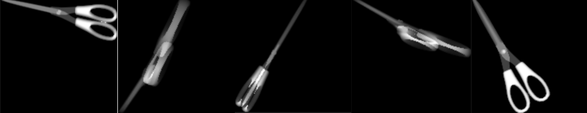

- 数据制备

  - 搜索相关素材网站，从网站上下载除了刀具类别外的其他类别模型（如水杯、手机、电脑等）（搜集到的文件格式是 obj 文件）

    具体要求：

    > 对于除了knife类别的其他所有8个类别（压力罐pressure，雨伞umbrella，打火机 lighter，塑料瓶 OCBottle，玻璃瓶 glassbottle，电池battery，金属瓶metabottle，电子设备electronicequipment），每个类别寻找一个可用的.obj文件，鼓励大家在有能力的情况下多找些.obj文件，视情况酌情加分（多找一些提升数据集的多样性
    >
    > 使用**meshlab**软件剔除一些不必要的信息（颜色、纹理等）（https://www.meshlab.net/#download）
    >
    > 素材网站：
    >
    > https://www.turbosquid.com/
    >
    > https://free3d.com/
    >
    > http://www.cgbawang.com/
    >
    > 。。。

- 代码相关：

  - 使用提供的代码，对所有的`.obj` 素材进行不同程度的旋转，基于生成的深度图进行渲染，生成模拟patch，将生成的patch粘贴到训练集的X光图像上，生成粘贴patch的模拟图像

    具体要求：

    > 对训练集中1500张图片，没张图片随机粘贴2～3个随机生成的patch（随机生成的patch指的是随机的类别、.obj目标、三维旋转角度、粘贴位置、补丁大小），请注意，目标的三维旋转角度需要与目标的平面俯视图具有一定的区别，如下图所示剪刀的 **5** 种三维旋转

    

  - 使用提供的代码，计算（2）中粘贴好patch的旋转标注框的四个顶点坐标，写入标注文件中

  - main 中代码类别（obj_dict）目前只有一个，需要增加

  - patch_size 生成patch的大小是写死的，需要改成随机？，生成patch只有一个，需要改成随机的多个

  - 旋转角度是写死的，需要改成随机的（或者改obj文件的旋转角度）（范围：0～360）

  - 粘贴部分只粘贴了一个，需要改成全部图片

- 模型训练

  - 使用自己生成的粘贴 **patch** 的扩展数据集与源训练集，训练一个旋转目标 检测模型 **Oriented RCNN** 模型。尝试针对 X 光场景下的三维旋转问题进 行改进，使得模型可以对 X 光场景下所有类别的旋转目标具有较好的检 测效果。
  - 用训练好的模型对测试集进行测试。

  具体要求：

  > 1. 旋转目标检测模型需使用 **Oriented RCNN** 模型(可使用原论文提供的代 码，或者 **mmrotate** 框架中的模型代码)
  > 2. 需尝试进行改进，如改进模型则代码需要可复现。 (具体可参考的方向:扩展数据集的优化、解决模拟样本与真实样本之间 存在的特征表示差异，即域迁移方法、利用模拟样本得到的三维旋转角度 进行改建等等)
  > 3. 仅可使用自己生成的粘贴 **patch** 的扩展数据集与源训练集进行训练，不可 以使用其他开源数据集进行训练。

- 评测平台注册
  - **http://221.122.70.196**
  - 注册后我邀请加入队伍
  - 算力平台：**https://git.openi.org.cn**

- 提交材料

  - 可复现模型代码
  - 最佳结果的模型文件
  - 最佳结果的输出文件 results.txt(具体格式详见平台)
  - 模型说明文档（整个大作业的文档），包括但不限于改进方式、调试过程、平台成绩截图等。

  